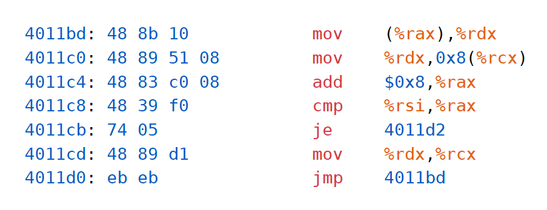

# typst-raw-style-for-x86-att-syntax-style

## Introduction

As we all know, the x86 assembly language has two syntax formats: intel and att. The intel syntax is more popular than the att syntax. So, there are not syntax definitions and highlighting in typst for att syntax format.

This repository is a collection of syntax definitions and highlighting files for x86 att syntax format. The syntax definitions are written in the sublime syntax format. The highlighting files are written in the tmTheme format.

## Usage

First, you need to clone this repository to your local machine and create a folder named `style` in the same directory as your typst file. Then, you can copy the `att.sublime-syntax` and `att.tmTheme` files to the `style` folder.

Then, you can add the following code to your typst file to use the theme:

```text
#show raw.where(lang: "att"): set raw(syntaxes: "./style/att.sublime-syntax", theme: "./style/att.tmTheme")
```

And use it by specifying the `att` language in the code block:

````text
```att
    4011bd: 48 8b 10            mov    (%rax),%rdx
    4011c0: 48 89 51 08         mov    %rdx,0x8(%rcx)
    4011c4: 48 83 c0 08         add    $0x8,%rax
    4011c8: 48 39 f0            cmp    %rsi,%rax
    4011cb: 74 05               je     4011d2
    4011cd: 48 89 d1            mov    %rdx,%rcx
    4011d0: eb eb               jmp    4011bd
```
````

At last, you will get the following result:

[](./example.png)
